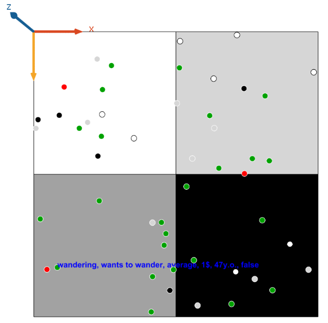

# ID2209 Distributed Artificial Intelligence and Intelligent Agents

## Description

This project is a simulation of different behaviours of festival guests (agents) at a festival (environment). These guests possess different traits, such as age or wealth, and the agents themselves can be of different types. Some may prefer to party more than others, whereas the majority are just regular visitors without any concrete preferences. Different agents behave differently in different environments. For example, an agent with preference to party, will end up going to the party area most of the time. However, this does not mean that that agent would not like to enjoy some quiet time in the relaxation area. The agent might wish to go there, but not as often. The simulation has a total of 50 agents running/interacting at the same time. Each of these agents behaves in its own personal interests, thus making the whole simulation resemble an actual festival.

## How To Run

Run GAMA 1.8 and open the Main.gaml file. Press the green button ‘my_experiment’ to run the simulation. The simulation consists of two main parts, the simulation itself with a 2D view on the 50 visitors, and a chart that plots the total sum of different activities that the visitors perform. If this approach does not work, try to create an empty project and copy paste the contents of the Main.gaml file into the created Model1.gaml. Then proceed normally.

When running the main simulation, only the first agent is going to log its actions in the console. This is done to not pollute the console when the simulation is running at high amounts of agents. Some parts of the output are also rendered on the simulation screen, and not only in the console. The requirements specify that the agents should be of at least 5 different types. To change the type of the agent, the variable agent_type should be changed. The options are: “average”, “party”, “chill”, “gambler”, and “weirdo”. The options will be explained later in greater detail.

## Screenshots

Simulation overview

## Agent Types

**Average** - the most common agent type in the simulation. Understanding that it is at a festival, this type likes to party a good amount, but does not forget that it needs to rest and occasionally gamble a little for the fun of it. Therefore, an average visitor would have the following “wish” distribution:
- Wander - 60%
- Party - 25%
- Chill - 10%
- Gamble - 5%

**Chill** - a type that prefers to hang out in the chill area, but doesn’t mind performing other actions as well. When bored, this agent might gamble a little bit more than average for some peculiar reason. Therefore, the “chill” agent has the following “wishes”:
- Wander - 40%
- Party - 15%
- Chill - 35%
- Gamble - 35%

**Party** - an agent type that prefers to party more than the rest. Being completely occupied with partying and only partying, this type does not gamble at all because it doesn’t have time for such silliness. Therefore, this type has the following “wish” behaviour:
- Wander - 45%
- Party - 40%
- Chill - 15%
- Gamble - 0%

**Gambler** - a type that prefers to be in the gambling area of the simulation. Obviously, loves nothing more than losing some money, but is up for occasional break or some partying, when getting weary of its financial losses. Therefore, the “gambler” agent has the following “wishes”:
- Wander - 40%
- Party - 10%
- Chill - 10%
- Gamble - 30%

**Weirdo** - a type that prefers to wander around the festival rather than do anything in particular. However, even weirdos do get bored sometimes, so this type can occasionally choose to do something more meaningful than just walking around and doing nothing. Therefore, this type has the following “wish” distribution:
- Wander - 85%
- Party - 5%
- Chill - 5%
- Gamble - 5%

## Agent Traits

As stated previously, agents can interact with one another and depending on their personalities the agents might get along and do an activity together if their personalities match. At the same time, they might dismiss each other if the personalities do not match. The way this works is an agent interacts with nearby agents with the FIPA protocol by sending the other agent his traits. Three traits used in this simulation are talkative (boolean), age (integer from 18 to 50), wealth (integer from 0 to 9).

The agent who receives the FIPA message, depending on his own traits and the location it is at, decides the outcome and responds positively or negatively. Each of the traits has a specific bond to a specific location. The correlation is:
- **Age**. Just for the sake of simplicity, the age is the main attribute linked to an agent’s wish to party with another agent, based on the assumption that people like to party within a certain age group. Therefore, if the agents are too apart in their age, they will not interact in the party area.
- **Wealth**. Wealth is the main attribute used for determining whether the agents are suitable for gambling in the gambling area. If one of the agent’s wealth parameters does not reach a certain minimum (which is based on the agent type), then the interaction will fail.
- **Talkative**. This attribute is used for determining whether the agents would be compatible to “chill” together. Since this parameter is a boolean, both of the agents in the interaction should have it set to the same value, be it true or false. If the attributes match, then the interaction is successful, otherwise, it is cancelled. However, it must be noted that different agent types might have different presets. For example, an agent of chill type will always want to “chill” with anyone, no matter what their talkative attribute is set to, because it is in its preferred area and is more accepting of other agents.

Therefore, agents will have completely different encounters with each other, all depending on their type, their age, their wealth and their talkative parameter. For example, an old rich gambler might never interact with a young poor party person because their characters are just too different. On top of this, it must be also taken into account that these two agents will have different preferences in what areas they like to visit, thus decreasing the chance of them interacting further.

## Agent Reflexes

Visitor agent has the following behaviour reflexes:
### go_wander

When an agents wish is to wander and it has no target point, the agent goes to wander until his wish is satisfied. This reflex does not make use of the in-built wander function, but rather implements a pattern that would resemble random movement that would allow to get to a completely new location quickly. This is done because wander function does not allow for a quick relocation and visually just represents some minor directional movement.
### eat

Since the food level is decreasing over time, once it hits 0, the agent has to go to eat something to replenish this parameter. So, a new target is set - eating location. Once the target point for eating has been reached, the parameter is refreshed with a random value within a certain range.
get_a_wish
This reflex is used to set a wish of an agent when it is equal to nil. A wish is randomly selected according to the type of the agent and the probabilities it has set. Note that eating is not a part of the wish list.
### party, chill, gamble
Same as the eat reflex, these are used to guide the agent to the corresponding location of what he wants to do and stay there until the wish is satisfied. However, one main difference is that eat reflex is instant once the target reaches the food destination. In the case of party, chill, gamble, these actions take some time to finish, usually 30 frames.
### ask_visitor
If there are other visitors nearby, the agent will ask them if they want to do something together.
### answer_visitor
When an agent receives a request, it decides what to do based on his traits. However, apart from the traits, the location of interaction matters as well. For example, if two agents are communicating in the gambling area, their interaction will depend on the wealth of both of the agents. On the other side, if the agents are communicating in the chill area, their interaction will depend on whether the characters are talkative or not.
